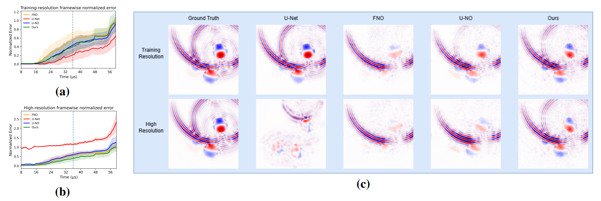

# [Submitted to ICASSP 2027] Neural Surrogate Modeling of Ultrasonic Wave Propagation in Heterogeneous Media

## Description
We study neural surrogate modeling for ultrasonic wave propagation in heterogeneous media, comparing U-Net, FNO, and U-NO across training and higher spatial resolutions. We proposed **Local-Integral Resampler U-shaped Neural Operator (LU-NO)**, in which we replace conventional downsampling and upsampling with learned local-integral resampling, while preserving the benefit of a U-shaped architecture. We observed improved cross-resolution generalization, particularly for reflected and scattered waves.

## Citation
Link to paper: Will be updated
<pre>
Will be updated
</pre>

